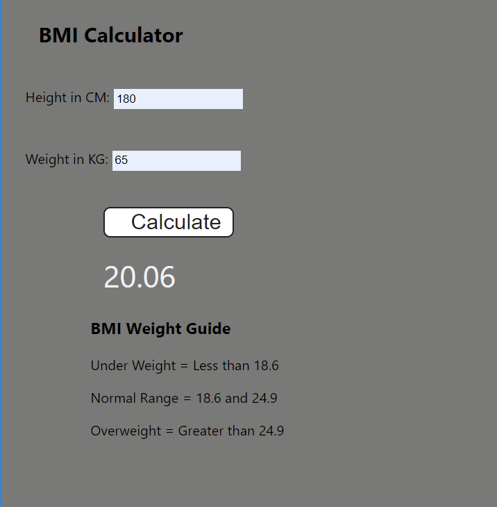

# Projects related to DOM

# Solution code

## project 1

### HTML :
```HTML
<!DOCTYPE html>
<html lang="en">
  <head>
    <meta charset="UTF-8" />
    <meta name="viewport" content="width=device-width, initial-scale=1.0" />
    <link rel="stylesheet" href="style.css" />
    <title>JavaScript Background Color Switcher</title>
  </head>
  <body>
    <div class="canvas">
      <!-- <a
        style="
          background-color: #fff;
          padding: 10px 30px;
          border-radius: 8px;
          color: #212121;
          text-decoration: none;
          border: 2px solid #212121;
        "
        href="../index.html"
        >Back to Home Page</a
      > -->
      <h1>Color Scheme Switcher</h1>
      <span class="button" id="grey"></span>
      <span class="button" id="purple"></span>
      <span class="button" id="blue"></span>
      <span class="button" id="yellow"></span>
      <h2>
        Try clicking on one of the colors above
        <span>to change the background color of this page!</span>
      </h2>
    </div>
    <script src="script.js"></script>
  </body>
</html>
```
### CSS :
```CSS 
html {
    margin: 0;
  }
  
  span {
    display: block;
  }
  .canvas {
    margin: 100px auto 100px;
    width: 80%;
    text-align: center;
  }
  
  .button {
    width: 100px;
    height: 100px;
    border: solid black 2px;
    display: inline-block;
  }
  
  #grey {
    background: grey;
  }
  
  #purple {
    background: purple;
  }
  #blue {
    background: blue;
  }
  #yellow {
    background: yellow;
  }
```
### JAVASCRIPT :
```javascript
const buttons = document.querySelectorAll('.button')
const body = document.querySelector("body")

buttons.forEach(function (button){
    console.log(button);
    button.addEventListener('click', function(e){
        console.log(e);
        console.log(e.target);
        if(e.target.id === "grey"){
            body.style.backgroundColor = e.target.id;
        }
        if(e.target.id === "purple"){
            body.style.backgroundColor = e.target.id;
        }
        if(e.target.id === "blue"){
            body.style.backgroundColor = e.target.id;
        }
        if(e.target.id === "yellow"){
            body.style.backgroundColor = e.target.id;
        }
    });
});
```
# OUTPUT :


## project 2

### HTML
```HTML
<!DOCTYPE html>
<html lang="en">
  <head>
    <meta charset="UTF-8" />
    <meta name="viewport" content="width=device-width, initial-scale=1.0" />
    <meta http-equiv="X-UA-Compatible" content="ie=edge" />
    <link rel="stylesheet" href="style.css" />
    <link rel="stylesheet" href="../styles.css" />
    <title>BMI Calculator</title>
  </head>
  <body>
    <nav>
      <a href="/" aria-current="page">Home</a>
      <a target="_blank" href="https://www.youtube.com/@chaiaurcode"
        >Youtube channel</a
      >
    </nav>
    <div class="container">
      <h1>BMI Calculator</h1>
      <form>
        <p><label>Height in CM: </label><input type="text" id="height" /></p>
        <p><label>Weight in KG: </label><input type="text" id="weight" /></p>
        <button>Calculate</button>
        <div id="results"></div>
        <div id="weight-guide">
          <h3>BMI Weight Guide</h3>
          <p>Under Weight = Less than 18.6</p>
          <p>Normal Range = 18.6 and 24.9</p>
          <p>Overweight = Greater than 24.9</p>
        </div>
      </form>
    </div>
  </body>
  <script src="chaiaurcode.js"></script>
</html>

```
### CSS
```CSS
.container {
    width: 575px;
    height: 825px;
  
    background-color: #797978;
    padding-left: 30px;
  }
  #height,
  #weight {
    width: 150px;
    height: 25px;
    margin-top: 30px;
  }
  
  #weight-guide {
    margin-left: 75px;
    margin-top: 25px;
  }
  
  #results {
    font-size: 35px;
    margin-left: 90px;
    margin-top: 20px;
    color: rgb(241, 241, 241);
  }
  
  button {
    width: 150px;
    height: 35px;
    margin-left: 90px;
    margin-top: 25px;
    background-color: #fff;
    padding: 1px 30px;
    border-radius: 8px;
    color: #212121;
    text-decoration: none;
    border: 2px solid #212121;
  
    font-size: 25px;
  }
  
  h1 {
    padding-left: 15px;
    padding-top: 25px;
    
  }
  
```
### JAVASCRIPT
```JAVASCRIPT
const form = document.querySelector('form');
// this usecase will give you empty value
// const height = parseInt(document.querySelector('#height').value);

form.addEventListener('submit', function(e){
    e.preventDefault()

    const height = parseInt(document.querySelector('#height').value);
    const weight = parseInt(document.querySelector('#weight').value);
    const results = document.querySelector('#results');

    if(height === '' || height < 0 || isNaN(height)){
        results.innerHTML = `Please give a valid height ${height}`;
    } else if(weight === '' || weight < 0 || isNaN(weight)){
        results.innerHTML = `Please give a valid weight ${weight}`;
    } else{
        const bmi = (weight / ((height*height)/10000)).toFixed(2);
        //show the result
        results.innerHTML = `<span>${bmi}</span>`;
    }
})

```
# OUTPUT :
