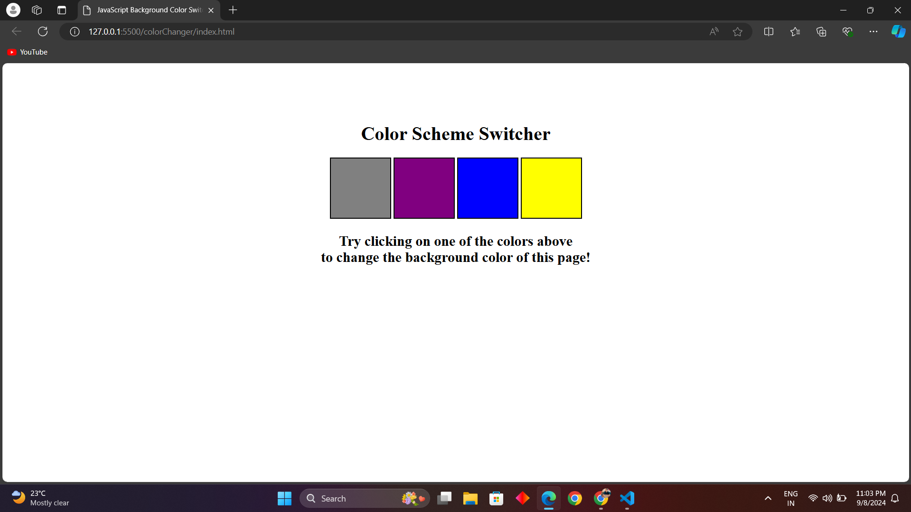

# Projects related to DOM

# Solution code

## project 1

### HTML :
```HTML
<!DOCTYPE html>
<html lang="en">
  <head>
    <meta charset="UTF-8" />
    <meta name="viewport" content="width=device-width, initial-scale=1.0" />
    <link rel="stylesheet" href="style.css" />
    <title>JavaScript Background Color Switcher</title>
  </head>
  <body>
    <div class="canvas">
      <!-- <a
        style="
          background-color: #fff;
          padding: 10px 30px;
          border-radius: 8px;
          color: #212121;
          text-decoration: none;
          border: 2px solid #212121;
        "
        href="../index.html"
        >Back to Home Page</a
      > -->
      <h1>Color Scheme Switcher</h1>
      <span class="button" id="grey"></span>
      <span class="button" id="purple"></span>
      <span class="button" id="blue"></span>
      <span class="button" id="yellow"></span>
      <h2>
        Try clicking on one of the colors above
        <span>to change the background color of this page!</span>
      </h2>
    </div>
    <script src="script.js"></script>
  </body>
</html>
```
### CSS :
```CSS 
html {
    margin: 0;
  }
  
  span {
    display: block;
  }
  .canvas {
    margin: 100px auto 100px;
    width: 80%;
    text-align: center;
  }
  
  .button {
    width: 100px;
    height: 100px;
    border: solid black 2px;
    display: inline-block;
  }
  
  #grey {
    background: grey;
  }
  
  #purple {
    background: purple;
  }
  #blue {
    background: blue;
  }
  #yellow {
    background: yellow;
  }
```
### JAVASCRIPT :
```javascript
const buttons = document.querySelectorAll('.button')
const body = document.querySelector("body")

buttons.forEach(function (button){
    console.log(button);
    button.addEventListener('click', function(e){
        console.log(e);
        console.log(e.target);
        if(e.target.id === "grey"){
            body.style.backgroundColor = e.target.id;
        }
        if(e.target.id === "purple"){
            body.style.backgroundColor = e.target.id;
        }
        if(e.target.id === "blue"){
            body.style.backgroundColor = e.target.id;
        }
        if(e.target.id === "yellow"){
            body.style.backgroundColor = e.target.id;
        }
    });
});
```
# OUTPUT :


# project 2

### HTML
```HTML

```
### CSS
```CSS

```
### JAVASCRIPT
```JAVASCRIPT

```