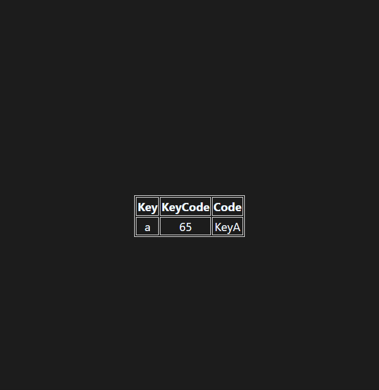

# Async JS:
#

#
## project 1 :

### HTML :
```HTML
<!DOCTYPE html>
<html lang="en">
  <head>
    <meta charset="UTF-8" />
    <meta name="viewport" content="width=device-width, initial-scale=1.0" />
    <meta http-equiv="X-UA-Compatible" content="ie=edge" />
    <title>Number Guessing Game</title>
    <link rel="stylesheet" href="style.css" />
    <link rel="stylesheet" href="../styles.css" />
  </head>
  <body style="background-color: #212121; color: #fff">
    <nav>
      <a href="/" aria-current="page">Home</a>
      <a target="_blank" href="https://www.youtube.com/@chaiaurcode"
        >Youtube channel</a
      >
    </nav>

    <h1>Start should change the Background color every second</h1>
    <button id="start">Start</button>
    <button id="stop">Stop</button>
    <script src="chaiaurcode.js"></script>
  </body>
</html>
```
#
### JAVASCRIPT :
```javascript
// generate a random color

const randomColor = function () {
  const hex = '0123456789ABCDEF';
  let color = '#';

  for (let i = 0; i < 6; i++) {
    color += hex[Math.floor(Math.random() * 16)];
  }
  return color;
};
let intervalId;
const startChangingColor = function () {
  if (intervalId == null) {
    intervalId = setInterval(changeBgColor, 500);

    function changeBgColor() {
      document.body.style.backgroundColor = randomColor();
    }
  }
};

const stopChangingColor = function () {
  clearInterval(intervalId);
  intervalId = null;
};

document.querySelector('#start').addEventListener('click', startChangingColor);

document.querySelector('#stop').addEventListener('click', stopChangingColor);
```
# OUTPUT :

#

## project 2 :

### HTML :
```HTML
<!DOCTYPE html>
<html lang="en">
  <head>
    <meta charset="UTF-8" />
    <meta name="viewport" content="width=device-width, initial-scale=1.0" />
    <link rel="stylesheet" href="style.css" />
    <title>Event KeyCodes</title>
    <link rel="stylesheet" type="text/css" href="../styles.css" />
    <style>
      table,
      th,
      td {
        border: 1px solid #e7e7e7;
      }
      .project {
        background-color: #1c1c1c;
        color: #ffffff;
        display: flex;
        align-items: center;
        justify-content: center;
        text-align: center;
        height: 100vh;
      }

      .color {
        color: aliceblue;
        display: flex;
        flex-direction: row;
      }
    </style>
  </head>
  <body>
    <nav>
      <a href="/" aria-current="page">Home</a>
      <a target="_blank" href="https://www.youtube.com/@chaiaurcode"
        >Youtube channel</a
      >
    </nav>
    <div class="project">
      <div id="insert">
        <div class="key">Press the key and watch magic</div>
      </div>
    </div>

    <script src="./chaiaurcode.js"></script>
  </body>
</html>
```
#
### JAVASCRIPT :
```javascript
const insert = document.getElementById('insert');

window.addEventListener('keydown', (e) => {
  insert.innerHTML = `
      <div class = "color">
      <table>
      <tr>
        <th>Key</th>
        <th>KeyCode</th>
        <th>Code</th>
      </tr>
      <tr>
        <td>${e.key === ' ' ? 'Space' : e.key}</td>
        <td>${e.keyCode}</td>
        <td>${e.code}</td>
      </tr>
    </table>    
      </div>
  `;
});
```
# OUTPUT :
