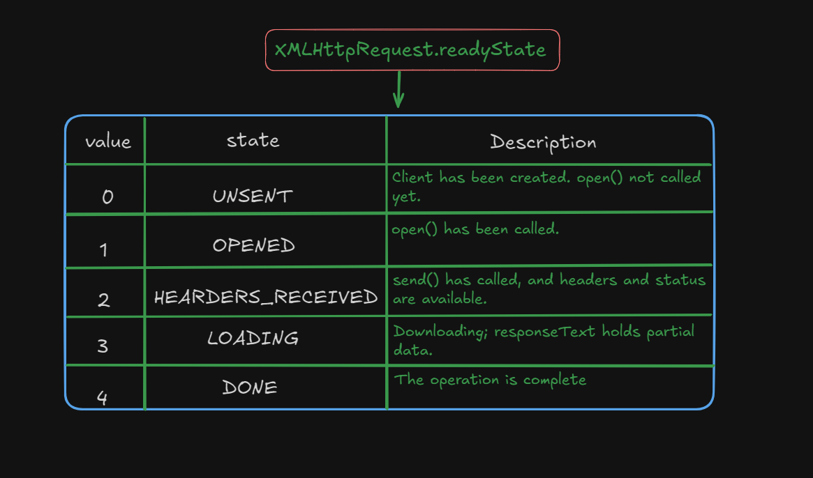
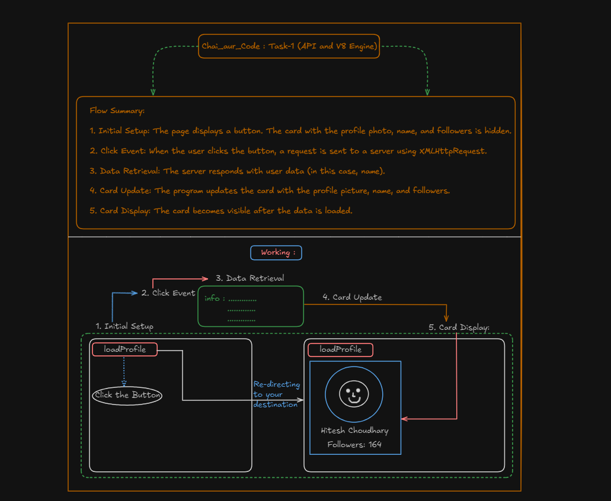

# API requests and V8 Engine : 

### XMLHTTPResquest.readyState :



## HTML | JAVASCRIPT :
``` HTML 
<!DOCTYPE html>
<html lang="en">

<head>
    <meta charset="UTF-8">
    <meta name="viewport" content="width=device-width, initial-scale=1.0">
    <title>Document</title>
</head>

<body style="background-color: #212121;">
    <script>
        const requestUrl = 'https://api.github.com/users/hiteshchoudhary'
        const xhr = new XMLHttpRequest();
        xhr.open('GET', requestUrl);
        xhr.onreadystatechange = function(){
            console.log(xhr.readyState);
            if(xhr.readyState === 4){
                const data = JSON.parse(this.responseText)
                console.log(typeof data);
                console.log(data.followers);
                console.log(data);
            }
        }
        // console.log("HERE");
        xhr.send();
    </script>
</body>

</html>
```
### Task-1 (ProfilePhoto & FollowersCount) :

## HTML | CSS | JAVASCRIPT : 

```HTML
<!DOCTYPE html>
<html lang="en">

<head>
    <meta charset="UTF-8">
    <meta name="viewport" content="width=device-width, initial-scale=1.0">
    <title>Button Redirect to Card</title>
    <style>
        button #loadCard {
            display: flex;
            align-items: center;
            justify-content: center;
        }

        .card {
            display: none;
            width: 300px;
            border: 1px solid #ccc;
            padding: 20px;
            border-radius: 10px;
            text-align: center;
            background-color: #000000;
        }

        .card img {
            width: 100%;
            border-radius: 50%;
        }

        .card h2,
        .card p {
            margin: 10px 0;
        }
    </style>
</head>

<body style="background-color: #212121; color: #fff;">
    <button id="loadCard">Load Profile</button>

    <div class="card" id="profileCard">
        
        <h2 id="profileName"></h2>
        <p>Followers: <span id="followersCount"></span></p>
    </div>

    <script>
        document.getElementById("loadCard").addEventListener('click', function () {
            // Create a new XMLHttpRequest object

            var xhr = new XMLHttpRequest();

            // configure it: GET-request for a demo API
            const avatar_url = 'https://api.github.com/users/hiteshchoudhary'
            xhr.open('GET', avatar_url, true);

            // Set up the onload event handler
            xhr.onload = function () {
                if (xhr.status == 200) {
                    // Parse the response JSON
                    var user = JSON.parse(xhr.responseText);

                    // Update the card with data
                    document.getElementById("profilePic").src = "https://avatars.githubusercontent.com/u/11613311?v=4" // Sample Photo

                    document.getElementById("profileName").textContent = user.name;

                    document.getElementById("followersCount").textContent = user.followers; //Random followers count
                    
                    // console.log(user)

                    // Display the card
                    document.getElementById("profileCard").style.display = "block";
                }
            };

            // Send the request
            xhr.send();
        })
    </script>
</body>

</html>
```

## WORKING :


# OUTPUT : 
