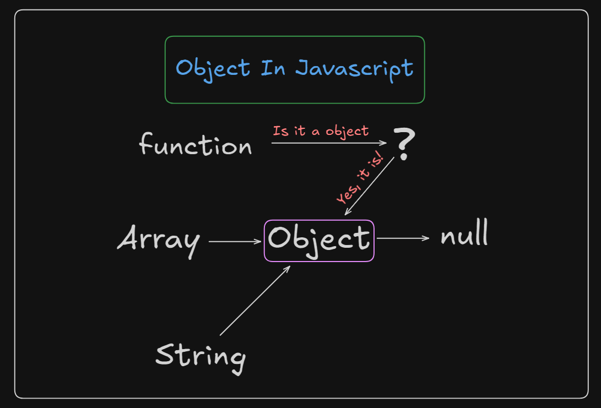
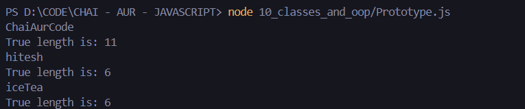
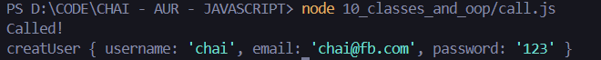

# Object Oriented Programming In Javascript :

## 1. Object :
- collection of properties and methods
- Example :- toUpperCase() , toLowerCase() , etc.

### JAVASCRIPT :
```js
function multiplyBy5(num){
    return num*5;
}

multiplyBy5.power = 2

console.log(multiplyBy5(5));
console.log(multiplyBy5.power);
console.log(multiplyBy5.prototype);

function createUser(username, price){
    this.username = username
    this.price = price
}

createUser.prototype.increment = function(){
   this.price++;
}

createUser.prototype.printMe = function(){
    console.log(`price is ${this.price}`);
}

const chai = new createUser("chai", 25)
const tea = new createUser("tea", 250)

chai.printMe()
```
## 2. Object relationship : 


## Question: why do we use Object Oriented Programming In Javascript ?
### Answer : 
In JavaScript, Object-Oriented Programming (OOP) is used for many of the same reasons as in other programming languages but with some specific benefits tailored to JavaScript's unique environment:
#
- 1. Code Organization and Modularity: OOP helps organize code into classes and objects, improving readability and manageability, especially in larger projects like web applications.
#
- 2. Reusability with Classes and Prototypes: JavaScript allows for reusable code through classes (introduced in ES6) or prototypes, enabling you to define methods and properties that can be reused across multiple objects.
#
- 3. Encapsulation: By grouping related variables (properties) and functions (methods) into objects, you encapsulate data and behaviors, protecting internal states from unintended interference and making your code more secure.
#
- 4. Inheritance: JavaScript supports inheritance, allowing you to extend classes or objects, which promotes code reuse. Child objects can inherit properties and methods from parent objects, reducing redundancy.
#
- 5. Polymorphism: With polymorphism, objects of different types can be accessed through the same interface, allowing you to use objects interchangeably while maintaining a consistent behavior.
#
- 6. Maintainability and Scalability: OOP structures in JavaScript help in building large-scale applications by separating concerns into different objects and modules. This makes the code easier to maintain and extend as the application grows.
#
- 7. Event-driven and UI-centric Applications: In JavaScript, especially in web development, objects representing UI elements or components (e.g., in frameworks like React.js) naturally map to OOP structures, improving the handling of events, state, and behavior.
#
- 8. Framework Support: Many modern JavaScript frameworks and libraries (like React, Angular, and Vue) rely on OOP principles, especially components, making it easier to work with them if you're familiar with OOP concepts.
#
In short, OOP in JavaScript is valuable for structuring code to be reusable, maintainable, and scalable, while aligning well with modern development patterns like component-based architectures.
#
### JAVASCRIPT (Issue of overriding an existing info) :
``` js
function User(username, loginCount, isLoggedIn){
    this.username = username
    this.loginCount = loginCount
    this.isLoggedIn = isLoggedIn

    this.greeting = function(){
        console.log(`Welcome ${this.username}`);
    }
    return this // no need to return 
}

const userOne = User("hitesh", 12, true)
const userTwo = User("ChaiAurCode", 11, false)
console.log(userOne); // userTwo info overrides --> userOne info, that's why 'new' keyword is used to stop the overriding of the info one object due to another. 
```
## 3. parts of OOP :
Object literal

- Constructor function

### JAVASCRIPT (Introduction to Constructor function) :
``` js
function User(username, loginCount, isLoggedIn){
    this.username = username
    this.loginCount = loginCount
    this.isLoggedIn = isLoggedIn

    this.greeting = function(){
        console.log(`Welcome ${this.username}`);
    }
    return this // no need to return 
}

const userOne = new User("hitesh", 12, true)
const userTwo = new User("ChaiAurCode", 11, false)
console.log(userOne);
console.log(userTwo);
```

- Prototypes
### JAVASCRIPT:
```js
// let myName = "hitesh     "

// console.log(myName.trim().length)
// console.log(myName.truelength);

let myHeros = ["thor", "spiderman"]

let heroPower = {
    thor: "hammer",
    spiderman: "sling",

    getSpiderPower: function(){
        console.log(`spidy power is ${this.spiderman}`);
    }
}

Object.prototype.hitesh = function(){
    console.log(`hitesh is present in all objects`);
}

Array.prototype.heyHitesh = function(){
    console.log(`Hitesh says hello`);
}

heroPower.hitesh()
myHeros.hitesh();

myHeros.heyHitesh();
// heroPower.heyHitesh(); // info only added for an Array not for an Object

// Inheritance

const User = {
    name: "chai",
    email: "chai@google.com"
}

const Teacher = {
    makeVideo: true
}

const TeachingSupport = {
    isAvailable: false
}

const TASupport = {
    makeAssignment: 'JS assignment',
    fullTime: true,
    __proto__: TeachingSupport
}

Teacher.__proto__ = User

// modern syntax

Object.setPrototypeOf(TeachingSupport, Teacher)
```
### Task 2 (Counting the length of a string making a function and using it for counting the length of the string) :

# Code (Javascript) :
```js
let anotherUsername = "ChaiAurCode     "

String.prototype.trueLength = function(){
    console.log(`${this}`);
    // console.log(`${this.name}`); // deprecated property
    console.log(`True length is: ${this.trim().length}`);
}

anotherUsername.trueLength()
"hitesh".trueLength()
"iceTea".trueLength()
```
### OUTPUT :

- Classes
- Instances (new, this)

### JAVASCRIPT (Introduction to 'new' Keyword) :
``` js
function User(username, loginCount, isLoggedIn){
    this.username = username
    this.loginCount = loginCount
    this.isLoggedIn = isLoggedIn

    this.greeting = function(){
        console.log(`Welcome ${this.username}`);
    }
    return this // no need to return 
}

const userOne = new User("hitesh", 12, true)
const userTwo = new User("ChaiAurCode", 11, false)
console.log(userOne);
console.log(userTwo);
```

### JAVASCRIPT (Introduction to 'this' Keyword) :
```js
const user = {
    username: "hitesh",
    loginCount: 8,
    signedIn: true,

    getUserDetails: function(){
        console.log("Got user details from database");
        console.log(`Username: ${this.username}`);
        // console.log(this); // current context
        
        
    }
}

console.log(user.username);
console.log(user.getUserDetails());
console.log(this)
```


## 4. pillars
- Abstraction
- Encapsulation
- Inheritance
- Polymorphism

## 5. call() function :

### JAVASCRIPT :
``` js
function setUsername(username){
    // complex DB calls
    this.username = username;
    console.log("Called!");
}

function creatUser(username, email, password){
    setUsername.call(this, username)

    this.email = email
    this.password = password    
}

const user = new creatUser("chai", "chai@fb.com", "123");
console.log(user);
```

### OUTPUT :

