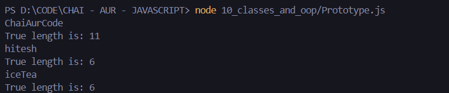

- Constructor :
### JAVASCRIPT (Introduction to Constructor function) :
``` js
class User {
    constructor(username, email, password){
        this.username = username;
        this.email = email
        this.password = password;
    }
    encryptPassword(){
        return `${this.password}abc`
    }
    changeUsername(){
        return `${this.username.toUpperCase()}`
    }
}

const chai = new User("chai", "chai@gmail.com", "123")

console.log(chai.encryptPassword());
console.log(chai.changeUsername());
```

- Prototypes :
### JAVASCRIPT (Introduction to prototypes In Javscript) :
```js
// let myName = "hitesh     "

// console.log(myName.trim().length)
// console.log(myName.truelength);

let myHeros = ["thor", "spiderman"]

let heroPower = {
    thor: "hammer",
    spiderman: "sling",

    getSpiderPower: function(){
        console.log(`spidy power is ${this.spiderman}`);
    }
}

Object.prototype.hitesh = function(){
    console.log(`hitesh is present in all objects`);
}

Array.prototype.heyHitesh = function(){
    console.log(`Hitesh says hello`);
}

heroPower.hitesh()
myHeros.hitesh();

myHeros.heyHitesh();
// heroPower.heyHitesh(); // info only added for an Array not for an Object

// Inheritance

const User = {
    name: "chai",
    email: "chai@google.com"
}

const Teacher = {
    makeVideo: true
}

const TeachingSupport = {
    isAvailable: false
}

const TASupport = {
    makeAssignment: 'JS assignment',
    fullTime: true,
    __proto__: TeachingSupport
}

Teacher.__proto__ = User

// modern syntax

Object.setPrototypeOf(TeachingSupport, Teacher)
```

### Task 2 (Counting the length of a string making a function and using it for counting the length of the string) :

# Code (Javascript) :
```js
let anotherUsername = "ChaiAurCode     "

String.prototype.trueLength = function(){
    console.log(`${this}`);
    // console.log(`${this.name}`); // deprecated property
    console.log(`True length is: ${this.trim().length}`);
}

anotherUsername.trueLength()
"hitesh".trueLength()
"iceTea".trueLength()
```
### OUTPUT :
